# 一.分类概览
## 并发安全（线程安全）
### 底层角度
1. 互斥同步
- 各种互斥同步锁
    - synchronized
    - ReentrantLock
    - ReadWriteLock
    - ...
- 同步工具类
    - Collections.synchronizedList(New ArrayList<E>())
    - Vector  
2. 非互斥同步
    - 6种原子类
        - 基本原子类
          - AtomicInteger:整型原子类
          - AtomicLong:长整型原子类
          - AtomicBoolean:布尔型原子类
        - Atomic*Array数组类型的原子类(数组里的元素都可以保证原子性)
          - AtomicInterArray:整型数组原子类
          - AtomicLongArray:长整形数组原子类
          - AtomicReferenceArray:引用类型数组原子类
        - Atomic*Reference引用类型原子类
          - AtomicReference:引用类型原子类
          - AtomicStampedReference:引用类型原子类升级,带时间戳,可以解决ABA问题
          - AtomicMarkableReference
        - Atomic*FieldUpdater升级原子类
          - 用Atomic*FieldUpdater等升级自己的变量
          - AtomicIntegerFieldUpdaterL原子更新整型字段的更新器
          - AtomicLongFieldUpdater:原子更新长整型字段更新器
        - Adder加法器(JDK1.8加入)
          - LongAdder
          - DoubleAdder
        - Accumulator累加器(JDK1.8加入)
          - LongAccumulator
          - DoubleAccumulator
            
3. 结合互斥和非互斥同步
    - 并发容器
        - ConcurrentHashMap(结合CAS和Synchronize)
        - CopyOnWriteArraylist
        - 并发队列
            - 阻塞队列(和线程池关系紧密)
                1. ArrayBlockingQueue
                2. LinkedBlockingQueue
                3. PriorityBlockingQueue
                4. SynchronousQueue
                5. DelayedQueue
                6. TransferQueue
                7. ...
            - 非阻塞队列
                - ConcurrentLinkedQueue
        - ConcurrentSkipListMap和ConcurrentSkipListSet
4. 无同步方案,不可变
    - final关键字
    - 线程封闭
        - ThreadLocal
        - 栈封闭
### 使用者角度
1. 避免共享变量
    - 线程封闭
        -  TreadLocal
        -  栈封闭
2. 共享变量,但是加以限制
    - 互斥同步
        - 使用各种互斥同步锁
          - synchronized
          - Lock接口的相关类
    - final关键字        
3. 使用成熟的工具类
    - 线程安全的并发容器
        - ConcurrentHashMap
        - CopyOnWriteArrayList
        - 并发队列
        - ConcurrentSkipListMap和ConcurrentSkipListSet
        - 使用同步工具类
    - atomic包,原子类    
## 线程管理
   - 线程池相关类
     - Executor
     - Executors
     - ExecutorService
     - 常见线程池
       - FixedTheadPool
       - CachedThreadPool
       - ScheduledThreadPool
       - SingleTheadPool
       - ForkJoinPool
       - ...
    
   - 能获取子线程的运行结果
     - Callable
     - Future
     - Future Task
     - ...
## 线程协作
  - CountDownLatch
  - CycliBarrier
  - Semaphore
  - Condition
  - Exchanger
  - Phaser
  - AQS
  - ...
---

# 二.线程池
## 为什么要用线程池
### 问题
1. 反复创建线程开销大
2. 过多的线程会占用太多内存
### 好处
1. 加快相应速度
2. 合理利用CPU和内存资源
3. 统一管理
### 使用场合
1. 服务器接收到大量请求,tomcat和netty内部都使用了线程池
2. 开发中,如果需要创建5个以上的线程,用线程池效率较高
## 创建和停止线程池
1.  构造函数的参数
    1. corePoolSize(int):核心线程数,通常会一直存活
    2. maxPoolSize(int):最大线程数
    3. keepAliveTime(long): 线程保持存活的最长时间(默认针对多余核心数量的线程)
    4. workQueue(Blocking Queue):任务存储队列
    5. thredFactory(TreadFactory):线程工厂
    6. Handler(RejectedExecutionHandler):拒绝处理器
2.  线程池应该手动创建还是自动创建
3.  线程池里面的线程数量设置为多少才合适 
4.  如何停止线程池
##线程里的线程数量设置成多少
1. CPU密集型(加密,计算hash等):最佳线程数为CPU核心数的1~2倍
2. 耗时IO(读写数据库,文件,网络读写等):参考Brain Goetz推荐的计算方法`线程数=CPU核心数*(1+平均等待时间/平均工作时间)
3. 实际以压测为准
##比较常见四种线程池的构造函数参数

 |Parameter| FixedThreadPool | CachedThreadPool |ScheduledThreadPool | SingleThreadPool|
 |-|-|-|-|-|
 |corePoolSize|constructor-arg|0|constructor-arg|1|
 |maxPoolSize|same as corePoolSize|Integer.MAX_VALUE|Integer.MAX_VALUE|1|
 |keepAliveTime|0 seconds|60 seconds|0 seconds|0 seconds|

 ## 阻塞队列分析
 1. FixedThreadPool和SingleThreadExecutor的Queue是LinkedBlockingQueue(无限大)
 2. CachedThreadPool使用的Queue是SynchronousQueue(不存储)
 3. ScheduledThreadPool用的DelayedWorkQueue
 4. JDK8加入workStealingPool线程池

 ## 停止线程
 1. shutdown():并不会马上停止,会把队列中等待的任务和正在执行的任务全部执行完,才会停止线程池,但是不会再接收新的任务
 2. isShutdown():判断线程池是否进入停止状态
 3. isTerminated():判断线程是否完全停止
 4. awaitTermination():测试线程池在未来几秒会不会停止,返回一个boolean值
 5. shutdownNow():立刻停止线程池,返回队列和正在执行的任务的列表

## 任务太多怎么拒绝
1. 拒绝时机
   1. 当Executor关闭时,新任务会被拒绝
   2. 当线程池所有线程都在执行任务,队列里面任务也满了,也会拒绝
2. 拒绝策略
   1. AbortPolicy:直接拒绝,抛出异常
   2. DiscardPolicy:默默丢弃,不会通知
   3. DiscardOldestPolicy:丢弃最老的
   4. CallerRunsPolicy:让提交任务的线程(一般是主线程)去执行任务,负反馈机制,给线程池缓冲时间
## 钩子算法
- 在任务执行前后加日志,统计之类的
- 代码演示:PauseableThreadPool.java

## 线程池组成部分
1. 线程池管理器
2. 工作线程
3. 任务队列(blocking queue)
4. 任务接口(Task)

## Executor家族


## 线程池状态
1. Running:接收新任务并处理排队任务
2. ShutDown:不接受新任务,但是处理排队任务
3. Stop:不接受新任务,也不处理排队任务,并且中断正在进行的任务
4. Terminated:terminate()执行完成
5. Tidying:所有任务都已经终止,workerCount为0,然后会运行terminate钩子方法

## 使用线程池的注意点
1. 避免任务堆积
2. 避免线程数过度增加
3. 排查线程泄露
----
# 三.ThreadLocal
## 两大使用场景
1. 每个线程需要一个独享的对象(通常是工具类,典型的包括SimpleDateFormat和Random,因为他们线程不安全)
    - 每个Thread内有自己的实例副本,不共享
    - 代码演示ThreadLocalNormalUsage00.java~ThreadLocalNormalUsage05.java
2. 每个线程内需要保存全局的变量(比如拦截器中获取用户信息),可以让不同方法直接使用,避免传递参数的麻烦
    - 遇到的问题:
        - 每一次业务传递都要传递用户信息
    - 解决方案1:
        - 图中才用静态的UserMap对象存储用户信息,可以如果涉及到多线程,是无法保证线程安全的
    - 解决方案1遇到的问题:
        - 这种情况下可以用Synchronize或者ConcurrentHashMap来解决,但是都会对性能造成影响
    - 最终解决方案:使用ThreadLocal
        - 用ThreadLocal保存一些业务内容(用户权限信息,用户名,userId等)
        - 这些信息在同一个线程内相同,在不同的线程内使用的业务内容是不相同的
        - 在线程生命周期里,都通过这个静态ThreadLocal实例的get()获取之前set过的那个对象,避免了对象作为传参的麻烦
        - 强调的是同一个请求(同一个线程里)不同方法的共享
        - 不需要重写initialValue()方法,但必须手动调用set()方法
3. 代码见[ThreadLocalNormalUsage06.java](src/main/java/com/lyming/threadlocal/ThreadLocalNormalUsage06.java)
4. 总结
    - ThreadLocal的两大作用
        1. 让某个需要用到的对象线程隔离(每个线程都有自己独立的对象)
        2. 在任何方法中都可以轻松获取到该对象
    - 根据对象的生成时机不同,选择initialValue()或者set()保存对象
        1. 在ThreadLocal第一次get的时候把对象给初始化出来,对象初始化受我们自己控制用`initialValue()`
        2. ThreadLocal保存的对象不由我们控制,比如由拦截器控制就用`set()`
    - ThreadLocal带来的好处
        1. 达到线程安全
        2. 不需要加锁,提高执行效率
        3. 更加高效利用内存,节省开销
        4. 避免传参的繁琐,降低耦合
## 原理
1. 区分Thread,ThreadLocal,ThreadMap
  
  在每个Thread中都持有一个ThreadMap对象
2. 常用方法
    - T initialValue():
        - 该方法会返回当前线程对应的初始值,这是一个延迟加载的方法,只有调用get()的时候才会触发;
        - 但是如果手动set,就不会调用initialValue();
        - 通常情况下,每个线程最多只调用一次该方法,除非调用了remove(),再次调用get()还是会调用initialValue()
        - 如果不重写initialValue(),默认会返回null,一般都使用匿名内部类来重写initialValue()方法
    - void set(T t):为该线程设置一个新值
    - T get():得到这个线程对应的Value,如果首次调用,则会调用initialValue()方法来得到该Value
    - void remove():删除对应这个线程的值
    -  **需要注意的是**保存的东西实际是保存在线程当中,而不是ThreadLocal中,通过源码可以知道,ThreadLocalMap是Thread的一个成员变量,而TreadLocal的Set方法,实际调用的是ThreadLocalMap的set(ThreadLocal local,T value)方法
    - ThreadLocalMap和HashMap很相似,有一点不同就是解决hash冲突的算法,常规的hashmap会采用拉链法,长度>8采用红黑树,而ThreadLocalMap则是采用线性探测法,将冲突的元素赋值给下一个空的内存中
## 需要注意的点
1. 内存泄露(某个内存不再使用,但是占用的内存不能被回收)
    1. 内存定义的特点:ThreadLocalMap中的entry继承WeakReference,是弱引用
    ```java
               static class Entry extends WeakReference<ThreadLocal<?>> {
                   /** The value associated with this ThreadLocal. */
                   Object value;
       
                   Entry(ThreadLocal<?> k, Object v) {
                       super(k);
                       value = v;
                   }
               }
    ```
   弱引用的特点是,如果这个对象只被弱引用关联(没有任何强引用关联),那么这个对象可以被GC回收.  
   所以可以看出ThreadLocalMap中的每个Entry都是一个对key的弱引用,同时,entry都包含了一个对value的强引用
   2. 正常情况下,当线程终止,保存在ThreadLocal中的value会被垃圾回收,因为没有任何强引用了
   3. 但是,如果线程不终止(比如线程需要保持很久,线程池里面的核心线程,他们是同一个线程反复被使用),那么key对应的value就不会被回收,因为有以下的调用链  
     `Thread-->ThreadLocalMap-->Entry(key为null)-->Value`  
     这样,value和Thread之间存在强引用链路,所以导致Value无法被回收,就会导致OOM  
     JDK已经考虑到这个问题,所以在set,remove,rehash方法中会扫描key为null的Entry,并把对应的value设置为null,这样value对象就可以被回收
     ```
       private void resize() {
           Entry[] oldTab = table;
           int oldLen = oldTab.length;
           int newLen = oldLen * 2;
           Entry[] newTab = new Entry[newLen];
           int count = 0;

           for (int j = 0; j < oldLen; ++j) {
               Entry e = oldTab[j];
               if (e != null) {
                   ThreadLocal<?> k = e.get();
                   if (k == null) {
                       e.value = null; // Help the GC
                   } else {
                       int h = k.threadLocalHashCode & (newLen - 1);
                       while (newTab[h] != null)
                           h = nextIndex(h, newLen);
                       newTab[h] = e;
                       count++;
                   }
               }
           }
     ```  
     但是这样还不够,因为这样的前提是调用这些方法来触发设置Value为null,如果一个ThreadLocal不被使用,那么实际上set,remove,rehash这些方法也不会被调用了,如果同时线程又不停止,那么调用链就一直存在,还是会导致内存泄露.
   4. 如何避免内存泄露(阿里规约)  
     调用remove方法,就会删除对用的entry对象,可以避免内存泄露,所以使用完ThreadLocal之后,手动调用remove方法
2. ThreadLocal空指针的问题  
    代码见[ThreadLocalNPE.java](src/main/java/com/lyming/threadlocal/ThreadLocalNPE.java),实际上装箱拆箱遇到的问题,不是ThreadLocal本身的问题
3. 共享对象  
    如果在每个线程内ThreadLocal.set()进去的东西本来就是多线程共享的同一个对象,比如static对象,那么get()到的还是这个共享对象,会有并发访问问题,所以static对象不要用ThreadLocal
4. 优先使用框架的支持,而不是自己创造  
    例如在Spring中,如果可以使用RequestContextHolder那么就不需要自己维护ThreadLocal,因为自己可能会忘记调用remove方法,造成内存泄露  
    可以看看DateTimeContextHolder类的源码
5. 每次HTTP请求都对应一个线程,线程之间相互隔离,这就是ThreadLocal的典型应用场景
----
# 四.各种锁
## Lock接口
1. 简介,地位,作用  
    - 锁是一种工具,用于控制对共享资源的方法  
    - Lock和synchronized,这两个是最常见的锁,他们都可以达到线程安全的目的,但在使用和功能上有较大的不同  
    - Lock并不是来替代synchronized的,而是当使用synchronized不适合或者不满足要求的时候,来提供高级功能
    - Lock接口最常见的实现类是`ReentrantLock`
    - 通常情况下,Lock只允许一个线程来访问这个共享资源.不过有些时候,一些特殊的实现也可以允许并发访问,比如ReadWriteLock中的`ReadLock`
2. 为什么synchronized不够用,为什么要Lock
    - 效率低:锁的释放情况少(1.完全执行完毕释放锁 2.异常,JVM来释放锁);试图获得锁时不能设置超时;不能中断一个正在试图获得锁的线程
    - 不够灵活(读写锁更灵活):加锁和释放的时间单一,每个锁仅有单一的条件(某个对象),可能是不够的
    - 无法知道是否成功获取到锁
3. 方法介绍
    - 四个常用方法:lock(),tryLock(),tryLock(long time,TimeUnit unit)和lockInterruptibly()
    - lock()就是最普通的获取锁,如果锁已经被其他线程获取,则进行等待  
        Lock不会像Synchronized一样在异常时自动释放锁,所以最佳实践是,在finally中释放锁,以保证发生异常时锁一定被释放
    - lock()方法不能被中断,这会带来很大的隐患:一旦陷入死锁,lock()就会陷入永久等待
    - tryLock()用来尝试获取锁,如果当前锁没有被其他线程占用,则获取成功,返回true,否则返回false,因此可以根据返回的结果来决定后续程序的行为
    - tryLock(long time,TimeUnit unit):超时就放弃
    - lockInterruptibly():相当于tryLock(long time,TimeUnit unit)把超时时间设置为无限,在等待锁的过程中,线程可以被中断
4. 可见性保证
    - Lock的加解锁和Synchronize的有同样的内存语义,也就是说,下一个线程加锁后可以看到前一个线程解锁前发生的所有操作(happens-before)
## 锁的分类
1. 分类是从不同角度去看的,并不是互斥的,也就是说一个锁可以同属多种类型,比如ReentrantLock既是互斥锁,又是可重入锁
2. 分类
    - 线程要不要锁住同步资源:锁住-->悲观锁;不锁住-->乐观锁
    - 多线程是否共享一把锁:可以-->共享锁;不可以-->独占锁
    - 多线程竞争时,是否排队:排队-->公平锁;先尝试插队,插队失败再排队-->非公平锁
    - 同一个线程是否可以重复获取同一把锁:可以-->可重入锁;不可以-->不可重入锁
    - 是否可以中断:可以-->可中断锁;不可以:非可中断锁
    - 等待锁的过程:自旋(不停的尝试)-->自旋锁;阻塞-->非自旋锁
## 乐观锁(又称为非互斥同步锁)和悲观锁(又称为互斥同步锁)
1. 悲观锁的劣势:
    - 阻塞和唤醒带来的性能劣势
    - 永久阻塞:如果持有锁的线程被永久阻塞,比如遇到了无限循环,死锁等活跃性问题,那么等待改线程释放锁的线程也将永远得不到执行
    - 优先级反转:优先级低的线程拿到锁,如果不释放,优先级高的线程也只能干等
2. 悲观锁考虑的太详细,为了保证结果的正确性,会在每次获取并修改资源时,把数据锁住,来确保万无一失
    - 最典型的悲观锁就是Synchronized和Lock相关类,Synchronized优化后前面有乐观的过程,但是总的还是悲观锁
    - 
    - 
3. 乐观锁
    - 认为自己在处理操作的时候不会有其他线程来干扰,所以并不会锁住被操作对象
    - 在更新的时候,去对比当前线程修改的期间数据有没有被其他人改变过:如果没有改变,则说明真的只有当前线程在操作,那就正常去修改数据
    - 如果数据和线程一开始拿到的不一样了,就说明别的线程在这段期间修改过数据,那就可以放弃修改,报错,重试等策略
    - 乐观锁的实现一般都是利用`CAS`算法来实现的,CAS(Compare and Swap)的核心就是在一个原子操作内,把数据对比而且交换,在此期间不被打断
    - 
    - 
    - 
    - 
    - 
    - 典型的例子就是原子类,并发容器,包括Git
    - 对数据库而言,`select for update`就是悲观锁,加入version概念就是乐观锁
4. 开销对比
    - 悲观锁的原始开销要高于乐观锁,但是一劳永逸
    - 乐观锁一开始的开销要比悲观锁小,但是如果自旋时间很长或者不停重试,那么消耗的资源也会越来越多
5. 使用场景
    - 悲观锁:适合并发`写入`多的情况,适用于临界区持锁时间比较长的情况,悲观锁可以避免大量的无用的自旋等操作,典型情况:
        - 临界区有IO操作
        - 临界区代码复杂或者循环量大
        - 临界区竞争非常激烈
    - 乐观锁:适合并发`写入`少,大部分是读取的场景,不加锁就能让读取性能大幅提高
## 可重入锁和非可重入锁,以ReentrantLock为例(重点)
1. ReentrantLock普通用法1:预订电影院座位  
      
      
      
    代码见[CinemaBookSeat.java](src/main/java/com/lyming/lock/reentrantlock/CinemaBookSeat.java)
2. ReentrantLock普通用法2:打印字符串  
    代码见[LockDemo.java](src/main/java/com/lyming/lock/reentrantlock/LockDemo.java)
3. 可重入性质
    - 什么是可重入?==>也称为递归锁,同一个线程可以多次获取同一把锁,不需要先释放再申请
    - 好处:避免死锁;提高了封装性
    - 代码见[GetHoldCount.java](src/main/java/com/lyming/lock/reentrantlock/GetHoldCount.java)  
      [RecursionDemo.java](src/main/java/com/lyming/lock/reentrantlock/RecursionDemo.java)
4. 源码对比:可重入锁ReentrantLock以及非可重入锁ThreadPoolExecutor的Worker类  
    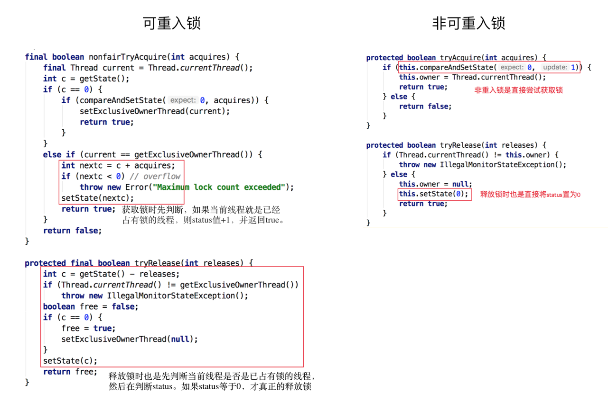
5. ReentrantLock的其他方法介绍(一般开发和调试的时候使用,上线后用的不多)
    - isHeldByCurrentThread:判断锁是否被当前线程持有
    - getQueueLength:返回当前正在等待这把锁的队列有多长
## 公平锁和非公平锁
1. 什么是公平和非公平
    - 公平指的是按照线程请求的顺序,来分配锁
    - 非公平指的是,`不完全`按照请求的顺序,`在一定情况下`可以插队,所以,非公平也同样不提倡插队,非公平指的是,`在合适的时机`插队,而不是盲目插队
    - 什么是合适的时机?  
      比如A,B,C三个线程,A持有锁,B请求这个锁,但是因为A还没有释放,所以B就去休息等待唤醒,当A执行完,释放锁,会唤醒B,但是这个时候C来请求这个锁,因为C一直没有休息,所以完全可能在B被唤醒之前,就持有了锁,并且执行
2. 为什么要有公平锁
    - java默认策略是非公平,上面的例子可以看出,非公平是为了提高效率,主要是`避免唤醒带来的空档期`,提高吞吐量,唤醒也是有开销的,
3. 公平的情况(以ReentrantLock为例)
    - ReentrantLock默认是非公平锁,但是创建的时候,参数选填true,那么就变成公平锁
4. 不公平的情况(以ReentrantLock为例)
5. 代码演示公平和非公平的效果
    - 代码见[FairLock.java](src/main/java/com/lyming/lock/reentrantlock/FairLock.java)
6. 特例(不遵守公平的情况)
    - 有一个方法叫tryLock(),它不遵守设定的公平的规则
    - 例如,当有线程执行tryLock()的时候,一旦有线程释放了锁,那么这个正在tryLock()的线程就能获取到锁,即使在它之前有其他线程在队列里面等待
7. 对比公平和不公平各自的优缺点
    ||优势|劣势|
    |-|-|-|
    |公平锁|个线程公平平等,每个线程在等待一段时间后,总有执行的机会|更慢,吞吐量小|
    |不公平锁|更快,吞吐量大|有可能产生线程饥饿,也就是某些线程在长时间内,始终得不到执行|
8. 源码分析
    
## 共享锁和排他锁:以ReentrantReadWriteLock读写锁为例(重点)
1. 什么是共享锁和排他锁
    - 排它锁又称为`独占锁`,`独享锁`,比如Synchronized
    - 共享锁,又称为`读锁`,获得共享锁之后,可以查看,但是无法修改和删除数据,其他线程此时也可以获取到共享锁,也可以查看但无法修改和删除数据
    - 共享锁和排他锁最典型的例子就是读写锁`ReentrantReadWriteLock`,其中读锁是共享锁,写锁是排他锁
2. 读写锁的作用
    - 在没有读写锁之前,我们假设使用ReentrantLock,那么虽然保证了线程安全,但是也浪费了一定的资源:多个读操作同时进行,其实并没有线程安全问题
3. 读写锁的规则
    - 多个线程只申请读锁,都可以申请到
    - 如果有一个线程已经占用了读锁,则此时其他线程如果要申请写锁,则申请写锁的线程会一直等待释放读锁
    - 如果有一个线程已经占用了写锁,则此时其他线程如果申请写锁或者读锁,则申请的线程会一直等待释放写锁
    - 总之:要么一个或多个线程同时持有读锁,要么一个线程持有写锁,两者不会同时出现(要么多读,要么一写)
    - 换一种思路:读写锁只是一把锁,可以通过两种方式锁定==>读锁定和写锁定,读写锁可以同时被一个或者多个线程读锁定,也可以被单一线程写锁定,但是永远不能同时对这把锁进行读锁定和写锁定
4. ReentrantReadWriteLock具体用法
    - [CinemaReadWrite.java](src/main/java/com/lyming/lock/readwrite/CinemaReadWrite.java)
5. 读锁和写锁的交互方式
    - 读线程插队
    - 升降级(读锁-->写锁 升级;写锁-->读锁 降级)
    - 以ReentrantReadWriteLock来说,它的设计不允许读线程插队,只允许降级,不允许升级
    - 读锁插队策略
        - 对于公平锁而言,不能插队
        - 对于非公平锁而言,比如线程2和线程4正在读取,线程3想要写入,拿不到锁,进入等待队列,但是此时线程5不在队列里,现在想要读取怎么办  
        两种情况:  
        效率高,但是容易造成饥饿  
        避免饥饿(ReentrantReadWriteLock现有策略)
        - 但是非公平锁也不能说完全不能插队的,当线程正在读,而且等待队列的`头结点`不是写,就可以插队,[NonfairBargeDemo.java](src/main/java/com/lyming/lock/readwrite/NonfairBargeDemo.java)
    - 锁的升降级
        - 支持锁的降级,不支持升级,需求为最开始拿到写锁的线程,后面只想读取,能不能在不释放锁资源的情况下,将写锁降级为读锁,因为写锁更占用资源
        - [Upgrading.java](src/main/java/com/lyming/lock/readwrite/Upgrading.java)
        - 只是ReentrantReadWriteLock不支持升级,可以自己写各种保证策略来升级,因为升级容易造成死锁
6. 总结
    - 相比于ReentrantLock适用于一般场合,ReentranReadWritetLock适用于读多写少的场景,提高高并发
## 自旋锁和阻塞锁
1. 自旋锁
    - 如果不使用自旋锁,阻塞或唤醒一个Java线程需要操作系统切换CPU状态来完成,这种状态转换需要耗费处理器时间
    - 如果同步代码块中的内容过于简单,状态转换消耗的时间可能比用户代码执行的时间还要长
    - 在许多场景中,同步资源的锁定时间很短,为了这一小段时间去切换线程,线程挂起和恢复线程的花费可能会让系统得不偿失
    - 如果物理机有多个处理器,能够让两个或以上的线程同时并行执行,那么我们可以让后面请求锁的线程不放弃CPU的执行时间
    - 为了让当前线程等一下,我们需要让当前线程进行自旋,如果在自旋完成后,前面锁定同步资源的线程已经释放了锁,那么当前线程可以不必阻塞而是直接获取同步资源,从而避免切换线程的开销,这就是自旋锁
    - 阻塞锁和自旋锁相反,阻塞锁如果遇到没有拿到锁的情况,会直接把线程阻塞,直到被唤醒(没什么特点,一般都说自旋锁比较多)
2. 自旋锁的缺点
    - 如果锁被占用的时间很长,那么自旋的线程只会白白浪费处理器资源
3. 自旋锁的原理和源码分析
    - 在jdk1.5及以上的并发框架java.util.concurrent的atomic包下的类基本都是自旋锁的实现
    - AtomicInteger的实现:自旋锁的实现原理是CAS,AtomicInteger调用unsafe进行自增操作的源码中的do-while循环就是一个自旋操作,如果修改过程中遇到其他线程竞争导致没有修改成功,就在while里死循环,直到修改成功
    - [SpinLock.java](src/main/java/com/lyming/lock/spinLock/SpinLock.java)
4. 自旋锁的使用场景
    - 自旋锁一般用于多核的服务器,在并发度特别高的情况下,效率比阻塞锁高
    - 另外,自旋锁适用于临界区比较短小的情况,否则如果临界区很大(线程一旦拿到锁,很久以后才会释放),那也不适合用自旋锁
## 可中断锁:可以相应中断的锁
1. 在Java中,Synchronized就不是可中断锁,而Lock是可中断锁,因为tryLock(time)和lockInterruptibly都能响应中断
2. 如果某一线程A正在执行锁中的代码,另一个线程B正在等待获取该锁,可能由于等待时间过长,线程B不想等待了,想先处理其他事情,我们可以中断它,这种就是可中断锁
## 锁优化
1. Java虚拟机对锁的优化
    - 自旋锁和自适应(自适应就是自旋一定次数就不尝试了,转为阻塞锁)
    - 锁消除:有一些场景不需要加锁,JVM会自动消除不必要的锁
    - 锁粗化:有些情况,很多加锁解锁是对同一对象,这样反复的加锁解锁也是一种开销,JVM会动态监测
2. 个人对锁的优化
    - 缩小同步代码块
    - 尽量不要锁住方法
    - 减少锁的申请次数
    - 避免人为制造'热点',比如hashMap的size()方法,通常是遍历一遍map中的元素,造成阻塞,不如单独维护一个单独的元素,存放size()的值
    - 锁中尽量不要包含锁,会造成死锁
    - 选择合适的锁类型或者合适的工具类(比如,多读少写就用读写锁,并发量不高就用原子类)
----
# 五.原子类
## 什么是原子类
1. 不可分割,一个操作是不可以中断的,即使多线程情况下也可以保证
2. 基本都在java.util.concurrent.atomic
3. 原子类的作用和锁类似 ,是为了保证并发情况下线程安全,不过原子类相比于锁,有一定的优势
    - 颗粒度更细:原子变量可以把竞争范围缩小到变量级别,这是一般情况下最细颗粒度的情况了
    - 效率更高:通常来说,原子类的效率会比锁的效率更高,除了`高度竞争`的情况
## 6类原子类纵览
1. 开局一张图  

## Atomic*基本类型原子类,以AtomicInteger为例
1. 基于CAS
2. 常用方法
    - public final int get():获取当前的值
    - public final int getAndSet(int newValue):获取当前值,并设置新值
    - public final int getAndIncrement():获取当前的值,并自增
    - public final int getAndDecrement():获取当前值并自减
    - public final int getAndAdd(int delta):获取当前值,并加上预期的值
    - boolean compareAndSet(int expect,int update)://如果当前的值等于预期值(expect),则以原子的方式将该值设置为输入的值(update)
    - [AtomicIntegerDemo.java](src/main/java/com/lyming/atomic/AtomicIntegerDemo1.java)
## Atomic*Array数组类型原子类
- 代码示例[AtomicArrayDemo.java](src/main/java/com/lyming/atomic/AtomicArrayDemo.java)
## Atomic*Reference引用类型原子类
- AtomicReference类的作用和AtomicInteger没有本质区别,AtomicInteger可以让一个整数保证原子性,而AtomicReference可以让一个对象保证原子性,而AtomicReference可以让一个对象保证原子性,当然,AtomicReference的功能明显
比AtomicInteger强,因为一个对象里可以包含很多属性,用法和AtomicInteger类似
- 之前的自旋锁就用到了,[SpinLock.java](src/main/java/com/lyming/atomic/spinLock/SpinLock.java)
## 把普通变量升级为原子类:用AtomicIntegerFieldUpdater升级原有变量
1. 试用场景:偶尔需要一个原子get-set操作
2. 代码示例[AtomicIntegerFieldUpdaterDemo.java](src/main/java/com/lyming/atomic/AtomicIntegerFieldUpdaterDemo.java)
3. 注意点
    - 不支持被static修饰的对象
    - 变量必须是可见的,所以一般都加volatile
## Adder累加器(jdk8引入)
1. 高并发下LongAdder比AtomicLong效率高,不过本质是空间换时间
2. 竞争激烈的时候,LongAdder把不同线程对应到不同的Cell(内部的一个结构)上去进行修改,降低了冲突的概率,是`多段锁`的理念,提高了并发性
3. 代码示例[AtomicLongDemo.java](src/main/java/com/lyming/atomic/AtomicLongDemo.java),[LongAdderDemo.java](src/main/java/com/lyming/lock/atomic/LongAdderDemo.java)  
这里演示多线程情况下AtomicLong的性能,有16个线程对同一个AtomicLong累加,对比性能
4. AtomicLong由于竞争很激烈,每一次加法,都要flush和refresh,导致消耗资源  
而LongAdder,每个线程有自己的一个计数器,仅用来在自己的线程内计数,这样就不会和其他线程的计数器干扰
5. LongAdder带来的改进和原理
    - LongAdder引入了分段累加的概念,内部有一个base变量和一个Cell[]数组共同参与计数
    - base变量:竞争不激烈,直接累加到该变量上
    - Cell[]数组:竞争激烈,各个线程分散累加到自己的槽Cell[i]中,对应的时候是计算了hash值
6. sum()方法的源码分析
```
    public long sum() {
        Cell[] as = cells; Cell a;
        long sum = base;
        if (as != null) {
            for (int i = 0; i < as.length; ++i) {
                if ((a = as[i]) != null)
                    sum += a.value;
            }
        }
        return sum;
    }
```
注意点:没有加锁,可能发生加过的数组的值又发生了变化,所以可能会不是很精确
7.对比AtomicLong和LongAdder
    - 在地竞争下,AtomicLong和LongAdder具有相似的特性,但在竞争激烈的情况下,LongAdder的预期吞吐量要高得多,但是更消耗空间
    - LongAdder适用的场景是统计求和和计数的场景,而且LongAdder基本只提供了add方法,而AtomicLong还提供了cas方法
## Accumulator累加器(不常用)
1. Accumulator和Adder非常相似,就是一个通用版本的Adder
2. 代码示例:[LongAccumulatorDemo.java](src/main/java/com/lyming/atomic/LongAccumulatorDemo.java)
----
# 六.CAS原理
## 什么是CAS
1. CAS==>CompareAndSwap是一种思想也是CPU的一条指令,主要用在并发编程领域
2. 思路:我认为V的值应该是A,如果是的话,我就改成B,如果不是A(说明计算过程中被别人修改了),那我就不修改了,避免多人同时修改导致出错
3. CAS有三个操作数:内存值V,预期值A,要修改的值B  

4. CAS其实也是CPU的特殊指令,由CPU保证其原子性
5. CAS的等价代码
[SimulatedCAS.java](src/main/java/com/lyming/cas/SimulatedCAS.java)
## 案例演示
[TwoThreadsCompetition.java](src/main/java/com/lyming/cas/TwoThreadsCompetition.java)
## 应用场景
1. 乐观锁
2. 原子类
3. 并发容器(比如ConcurrentHashMap)
## 以AtomicInteger为例,分析java是如何利用CAS实现原子操作
1. AtomicInteger加载`Unsafe`工具,用来直接操作内存数据
2. 用Unsafe来实现底层操作
3. 用volatile修饰value字段,保证可见性
4. Unsafe类
    - Unsafe是CAS的核心类,java无法直接访问底层操作系统,而是通过本地(native)方法来访问,不过尽管如此,JVM还是开了一个后门,JDK中有一个Unsafe类,它提供了硬件级别的原子操作
    - valueOffset表示的是变量值在内存中的偏移地址,因为Unsafe就是根据内存偏移地址获取数据的原值,这就就能通过Unsafe来实现CAS了
## 缺点
1. ABA问题==>加版本号解决
2. 自旋时间过长:自旋一般都是whle死循环,在竞争激烈的情况下很消耗CPU资源
----
# 七.final关键字和不变性
## 什么是不变性(Immutable)
1. 如果对象在被创建后,状态就不能被修改,那么它就不可变
2. 具有不可变性的对象一定是线程安全的,不需要对其采取任何额外的保护措施,也能保证线程安全
## final的作用
1. 早期
    - 锁定
    - 效率:早期的java实现版本,会将final方法转换为内嵌方法,提高性能
2. 现在
    - 类防止被继承,方法防止被重写,变量防止被修改
    - 天生是线程安全的,而不需要额外的同步开销
## 3种用法:修饰变量,方法,类
1. final修饰变量
    - 含义:被final修饰的变量,意味着值不能被修改,如果变量是对象,那么对象的引用不能变,但是对象自身的内容依然可以变化
    - final instance variable(类中的final属性)
        - 第一种在声明变量的等号右边直接赋值
        - 第二种是在构造函数中赋值
        - 第三种是在类的初始代码块中赋值(不常用)
        - 如果不采用第一种方法,就必须在第2,3中挑选一种来赋值,不能不赋值
    - final static variable(类中的static final属性)
        - 第一种声明变量的右边直接赋值
        - 第二种是在static初始代码块中复制,不能用普通初始代码块赋值
    - final local variable(方法中的final变量)
        - 要求在使用前赋值,和非final的变量是一样的
2. final修饰方法
    - 构造方法不允许被final修饰
    - 被修饰的方法不能被override
    - 额外提一点:static方法不能被重写,但是和final修饰不同的是,子类可以写同名的方法
3. final修饰类
    - 不可被继承,最典型的就是String
## 不变性和final的关系
1. 不变性并不意味着,简单的用final就是不可变
    - 对于基本数据类型,确定被final修饰后就具有不变性
        - 对于基本数据类型,确实被final修饰后就具备不变性
        - 对于引用类型,要保证该对象自身被创建后,状态永远不会变才可以(比如一个Person类有三个属性,两个被final修饰,一个没有,那么就不满足)
2. 如何利用final实现对象不可变
    - 把所有属性都声明为final?`[×]`  
    如果能往下一层一层有一个可变,那么即便声明为final也不是不可变的,比如Person类有三个属性,都是final修饰,但是有一个属性又是一个类,这个类中有可变的属性,那整体Person而言也还是可变的
    - 一个属性是对象类型的不可变对象的正确实现
        - [ImmutableDemo.java](src/main/java/com/lyming/immutable/ImmutableDemo.java)
        - 对象创建后,其状态就不能修改
        - 所有属性都是final修饰的
        - 对象创建过程中没有发生溢出
3. 把变量写在线程内部--栈封闭
    - 在方法中新建的局部变量,实际上是存储在每个线程私有的栈空间,不能被其他线程所访问到,这就是`栈封闭`技术,是`线程封闭`的一种情况
    - 代码演示[StackConfinement.java](src/main/java/com/lyming/immutable/StackConfinement.java)
----
# 八.并发容器
## 并发容器概览
1. ConcurrentHashMap:线程安全的HashMap
2. CopyOnWriteArrayList:线程安全的List
3. BlockingQueue:这是一个接口,表示阻塞队列,非常适用于作为数据共享的通道
4. ConcurrentLinkedQueue:高效的非阻塞并发队列,使用链表实现,可以看做线程安全的LinkedList
5. ConcurrentSkipListMap:是一个Map.使用跳跃表的数据结构进行快速查找,用的场景不是很多
## 集合类的历史--古老和过时的同步容器
1. Vector和Hashtable
    - 早起出现,用Synchronize锁住了关键方法,保证了线程安全,但在并发环境下,效率低
2. ArrayList和HashMap
    - 线程不安全,因为关键方法没加锁
    - 虽然这两个类是线程不安全的,但是可以用`Collocations.synchronizedList(new ArrayList<E>())`和
    `Collections.synchronizedMap(new HashMap<K,V>())`使之变成线程安全,原理是加了同步代码块,实际上和Vector和Hashtabel优化没多少
3. ConcurrentHashMap和CopyOnWriteArrayList
    - 取代同步的HashMap和同步的ArrayList
    - 在绝大多数并发情况下,ConcurrentHashMap和CopyOnWriteArrayList的性能都更好,CopyOnWriteArrayList性能低的唯一例外是集合中的元素经常被修改,
    因为CopyOnWriteArrayList每一次修改就要重新完整复制整个集合,所以更适合读多写少的场景;而ConcurrentHashMap几乎没有例外,就是更好
## ConcurrentHashMap(面试常考)
1. Map简介
    - HashMap(HashMap中key和value都允许为null。key为null的键值对永远都放在以table[0]为头结点的链表中。)
    - Hashtable(不推荐使用了,key和value都不允许为null,因为为null在计算hash值的时候直接会抛出NPE)
    - LinkedHashMap(HashMap的子类,保存了插入的记录顺序,方便遍历)
    - TreeMap(实现了sorted接口,所以可以根据key排序,默认是升序,可以自定义排序)
    - 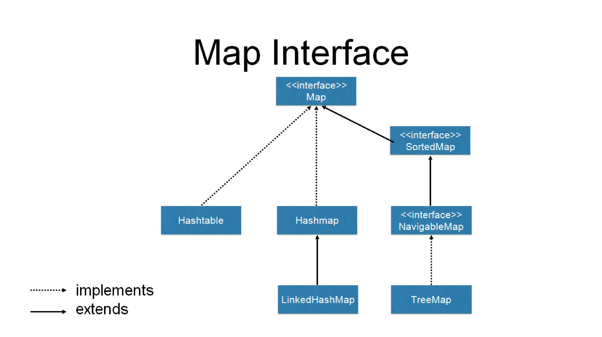
    - 
2. 为什么需要ConcurrentHashMap
    - 因为用了`Collections.synchronizedMap(new HashMap<K,V>())`,在高并发环境下,也没有多少效率提升
    - HashMap又是线程不安全的
    - 为什么HashMap线程不安全
        - 同时put碰撞导致数据丢失
        - 同时put扩容导致数据丢失
        - 死循环造成CPU100%(主要存在JDK1.7及以前版本中):没什么好说的,就是扩容的时候形成循环链表,就是指针你指向我,我指向你,造成死循环,就是用错类了,高并发下就不应该用HashMap
3. HashMap分析,尤其是JDK1.8
    - JDK1.7:拉链法
        - 
        - 
    - JDK8:除了拉链法,出现了红黑树
        - 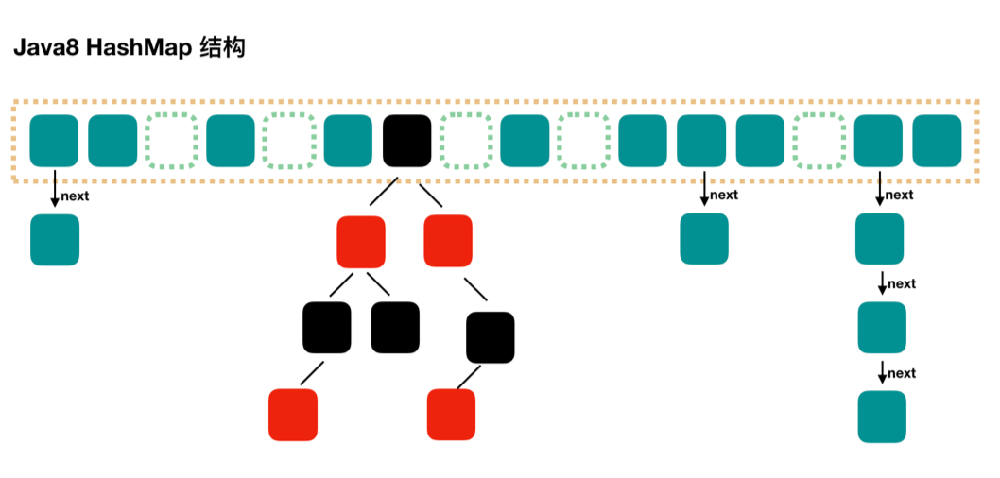
        - 红黑树是对二叉查找树的一种平衡策略,O(logN)VSO(N);会自动平衡,防止极端不平衡从而影响查找效率
        - 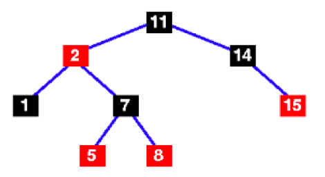
    - 红黑树
        - 每个节点要么是红色要么是黑色,根节点永远是黑色
        - 红色节点不能连续(即红色节点的孩子和父亲不能是红色)
        - 从任一节点到其子树中的叶子节点的路径都包含相同数量的黑色节点
        - 所有的叶子节点都是黑色的
    - HashMap关于并发的特点
        - 非线程安全
        - 迭代的时候不允许修改内容
        - 只读是并发安全的
        - 如果一定要把HashMap用在并发环境,用Collections.SynchronizedMap(new HashMap())
4. JDK1.7中ConcurrentHashMap实现和分析
    - JDK1.7的ConcurrentHashMap 
    
    
    - JDK1.7中的ConcurrentHashMap最外层是多个`segment`,每个segment的底层数据结构与`HashMap`类似,仍然是数组和链表组成的拉链法
    - 每个segment独立上`ReentrantLock`,每个segment之间互不影响,提高了并发效率
    - ConcurrentHashMap默认有16个segment,所以最多同时支持16个线程并发`写`(操作分别分布在不同的segment上),这个默认值可以在初始化的时候设置为其他值,
    但是一旦初始化以后,是`不可以扩容的`.
5. JDK8中ConcurrentHashMap实现和分析
    - 与JDK1.7相比,完全重写,源码从1000+到6000+
    - JDK8的ConcurrentHashMap
    
    - 源码分析
        - public V put(K key, V value) :  
        实际调用了`final V putVal(K key, V value, boolean onlyIfAbsent)`  
        ```
          public V put(K key, V value) {
              return putVal(key, value, false);
          }
        ```  
      
      在putVal()中  
      ```
        if (key == null || value == null) throw new NullPointerException();//key和value均不能为null,否则抛出NPE
                int hash = spread(key.hashCode());//计算Hash值
                int binCount = 0;
                //在整个for循环中完成了插入工作
                for (Node<K,V>[] tab = table;;) {
                    Node<K,V> f; int n, i, fh;
                    if (tab == null || (n = tab.length) == 0)//判断tab是否为空或者没有值,tab就是一个node节点
                        tab = initTable();//初始化tab
                    else if ((f = tabAt(tab, i = (n - 1) & hash)) == null) {//如果已经初始化过了,而且计算出来的hash节点没有被占用
                        if (casTabAt(tab, i, null,//就用cas操作放进去,是利用Unsafe的操作
                                     new Node<K,V>(hash, key, value, null)))
                            break;//成功放进去,就退出for循环
                    }
                    else if ((fh = f.hash) == MOVED)//MOVED是转义节点,表示当前槽点正在扩容
                        tab = helpTransfer(tab, f);//如果计算出来的hash对应的槽点为MOVED,就去帮助扩容和转移
                    else {//如果计算出来的槽点有值就会进入下面的代码
                        V oldVal = null;
                        synchronized (f) {//加锁
                            if (tabAt(tab, i) == f) {
                                if (fh >= 0) {
                                    binCount = 1;
                                    //for循环是进行链表的操作,根据hash值找到对应的位置
                                    for (Node<K,V> e = f;; ++binCount) {
                                        K ek;
                                        //如果链表的位置上有值
                                        if (e.hash == hash &&
                                            ((ek = e.key) == key ||
                                             (ek != null && key.equals(ek)))) {
                                            oldVal = e.val;//把原来的值赋值给oldVal
                                            if (!onlyIfAbsent)
                                                e.val = value;
                                            break;
                                        }
                                        //跳过if,说明不存在这个key,创建一个新节点,并放在链表最后
                                        Node<K,V> pred = e;
                                        if ((e = e.next) == null) {
                                            pred.next = new Node<K,V>(hash, key,
                                                                      value, null);
                                            break;
                                        }
                                    }
                                }
                                //走到这里说明是一个红黑树
                                else if (f instanceof TreeBin) {
                                    Node<K,V> p;
                                    binCount = 2;
                                    //把值放到树中去
                                    if ((p = ((TreeBin<K,V>)f).putTreeVal(hash, key,
                                                                   value)) != null) {
                                        oldVal = p.val;//同样返回之前的值
                                        if (!onlyIfAbsent)
                                            p.val = value;
                                    }
                                }
                            }
                        }
                        //完成添加工作,在这里是要判断是否需要转成红黑树
                        if (binCount != 0) {
                            if (binCount >= TREEIFY_THRESHOLD)//TREEIFY_THRESHOLD=8
                                treeifyBin(tab, i);//开始转成红黑树,除了上面大于8的条件,这个方法里还有一个容量要不小于64的条件
                            if (oldVal != null)
                                return oldVal;
                            break;
                        }
                    }
                }
                addCount(1L, binCount);
                return null;
      ```
      
         - public V get(Object key):  
        ```
            public V get(Object key) {
                Node<K,V>[] tab; Node<K,V> e, p; int n, eh; K ek;
                int h = spread(key.hashCode());//计算hash值
                if ((tab = table) != null && (n = tab.length) > 0 &&//tab不能为null且长度要大于0
                    (e = tabAt(tab, (n - 1) & h)) != null) {
                    if ((eh = e.hash) == h) {
                        if ((ek = e.key) == key || (ek != null && key.equals(ek)))//槽点的hash值符合,key符合,说明找到了value
                            return e.val;
                    }
                    else if (eh < 0)//如果hash值为负数,说明是红黑树节点或者是转义节点
                        return (p = e.find(h, key)) != null ? p.val : null;
                    while ((e = e.next) != null) {//如果上面都不是,就说明是链表
                        if (e.hash == h &&
                            ((ek = e.key) == key || (ek != null && key.equals(ek))))
                            return e.val;
                    }
                }
                return null;//tab不能为null且长度要大于0,否则直接返回null,容器还没初始化完毕
            }
        ```
    - 文字描述
        - public V put(K key, V value) :
            - 判断key,value不为null
            - 计算hash值
            - 根据对应位置节点的类型来赋值,或者helpTransfer(),或者增长链表,或者给红黑树增加节点
            - 满足阈值就转变成红黑树
            - 返回oldVal
        - public V get(Object key):
            - 计算hash值
            - 找到对应的位置,根据情况进行:
            - 直接取值
            - 红黑树里取值
            - 遍历链表取值
            - 返回找到的value
            
6. 对比JDK1.7和JDK8的优缺点,为什么要升级成JDK8中的那样
    - 数据结构:从1.7中默认16个segment变成每个node都独立,提高并发度
    - Hash碰撞:1.7中如果发生hash碰撞采取拉链法,java8中先是拉链法,大于8后变成红黑树
    - 并发安全:1.7中才用分段锁,利用Segment保证线程安全,而Segment继承于ReentrantLock;java8中是CAS+Synchronize
    - 查询复杂度:链表查询的时间复杂度为O(N),而如果转换成红黑树,就从O(N)降低为O(longN)
    - 为什么选择8转换成红黑树呢?
        - 源码的注释提供了参考,其实正常情况下链表长度是不会超过8的,注释中列举了泊松分布的概率,链表长度为8的概率已经低到0.00000006了,所以其实转换成红黑树是一种极端情况
        - 在数据量不多的时候,小于8的时候,红黑树并不划算,因为红黑树每个节点占用的空间是链表节点的两倍
7. 组合操作:ConcurrentHashMap也不是线程安全的?
    - 错误的使用会造成ConcurrentHashMap不是线程安全的
    - 代码示例:[组合操作并不保证线程安全](src/main/java/com/lyming/collections/concurrenthashmap/OptionsNotSafe.java)
## CopyOnWriteArrayList
1. 诞生的原因
    - jdk5引入,用来代替Vector和SynchronizedList就像ConcurrentHashMap代替SynchronizedMap的原因一样
    - Vector和SynchronizedList的锁的粒度太大,并发效率相对比较低,而且迭代时无法编辑
    - Copy-On-Write并发容器还包括CopyOnWriteArraySet,用来替代同步Set
2. 适用的场景
    - 读操作要尽可能的快,写操作慢一点也没关系
    - 读多写少:黑白名单,每日更新;监听器,迭代操作远多于修改操作
3. 读写规则
    - 回顾读写锁(ReadWriteLock):读读共享,其他都互斥(写写,写读,读写都互斥)
    - 读取是完全不加锁的,而且写入也不会阻塞读取操作,只有写和写需要同步等待
4. 实现原理
    - 如果要修改,拷贝一份再在新的一份里修改,最后再把指向原本的指针指向新的一份,之前那一份就会被回收
    - 创建新副本,读写分离的思想
    - '不可变'原理:以前的那一份在读的时候是完全并发安全的,因为写操作都在新副本中进行
    - 迭代期间的数据可能是过期的,因为哪怕修改的,也是用最开始的那一份数据
    - 代码见[CopyOnWriteArrayListDemo1](src/main/java/com/lyming/collections/copyonwrite/CopyOnWriteArrayListDemo1.java) [CopyOnWriteArrayListDemo2](src/main/java/com/lyming/collections/copyonwrite/CopyOnWriteArrayListDemo2.java)
5. 缺点
    - 数据一致性问题:CopyOnWrite容器只能保证数据最终一致性,不能保证数据的实时一致性,所以如果希望这种强一致性,不要用CopyOnWrite容器
    - 内存占用问题: 因为CopyOnWrite的写实复制机制,所以在进行写操作的时候,内存中会同时驻扎两个对象的内存
6. 源码分析
```
public class CopyOnWriteArrayList<E>
    implements List<E>, RandomAccess, Cloneable, java.io.Serializable {
    private static final long serialVersionUID = 8673264195747942595L;

    /** 用的ReentrantLock*/
    final transient ReentrantLock lock = new ReentrantLock();

    /** The array, accessed only via getArray/setArray. */
    private transient volatile Object[] array;
```
## 并发队列Queue(阻塞队列,非阻塞队列)
1. 为什么要使用队列
    - 用队列可以在线程间传递数据:生产者消费者模式,银行转账
    - 考虑锁等线程安全问题的重任从人转移到了队列上
2. 并发队列的简介
    - Queue:保存一组等待处理的数据,会有很多种实现,底层实现有一种是linkedList,但是对随机访问的需求,Queue根本不提供方法
    - BlockingQueue:队列为空,取的操作会一直阻塞,队列满了,插入的操作为被阻塞
3. 并发队列关系图
    - 
    - 还有一种queue叫`deque`,双端都可以插入可删除
4. 阻塞队列BlockingQueue
    - 什么是阻塞队列
        - 阻塞队列是具有阻塞功能的队列,所以首先它是一个队列,其次是具有阻塞功能
        - 通常,阻塞队列的一段是给生产者放数据用,另一端给消费者拿数据用,阻塞队列是`线程安全`的,所以生产者和消费者都可以是多线程的  
        
    - 主要方法介绍
        - take()方法:获取并移除队列的头结点,一旦执行take()的时候,队列里无数据,则阻塞,知道队列里有数据  
        
        - put()方法:插入元素,如果队列已满,就无法继续插入,则阻塞知道队列里有空闲空间  
          
        - 是否有界(容量有多大):这是一个非常重要的属性,无界队列意味着里面可以容纳非常多(Integer.MAX_VALUE,约为2的31次,可以认为是无限容量)
        - 阻塞队列和线程池的关系:阻塞队列是线程池的重要组成部分
        - add(),remove(),element():  
        add()和remove()与之前的take()和put()作用很相似,但是不会阻塞,而是直接抛出异常;  
        element()会返回队列的头元素,如果没有,也会抛出异常
        - offer(),poll(),peek():  
        offer()添加元素,如果满了,会返回一个false  
        poll()和peek()都会取一个元素,如果没取到就返回null,他们的区别是poll()取的同时会删除队列的元素
    - ArrayBlockingQueue
        - 有界,创建时要指定容量
        - 公平:还可以指定是否需要保证公平,如果想保证公平,那么等待了最长时间的线程会先被处理,不过这样会带来一定的性能损耗
        - 代码见[ArrayBlockingQueueDemo.java](src/main/java/com/lyming/collections/queue/ArrayBlockingQueueDemo.java)
    - LinkedBlockingQueue
        - 无界:Integer.Max_Value
        - 内部结构:Node,两把锁
    - PriorityBlockingQueue
        - 支持优先级
        - 自然排序(而不是先进先出,自己实现CompareTo方法)
        - 无界队列
        - 可以看做PriorityQueue的线程安全版本
    - SynchronousQueue
        - 它的容量为0
        - 需要注意的是,SynchronousQueue的容量是0,而不是1,因为SynchronousQueue不需要持有元素,它所要做的就是直接传递(direct handoff)
        - 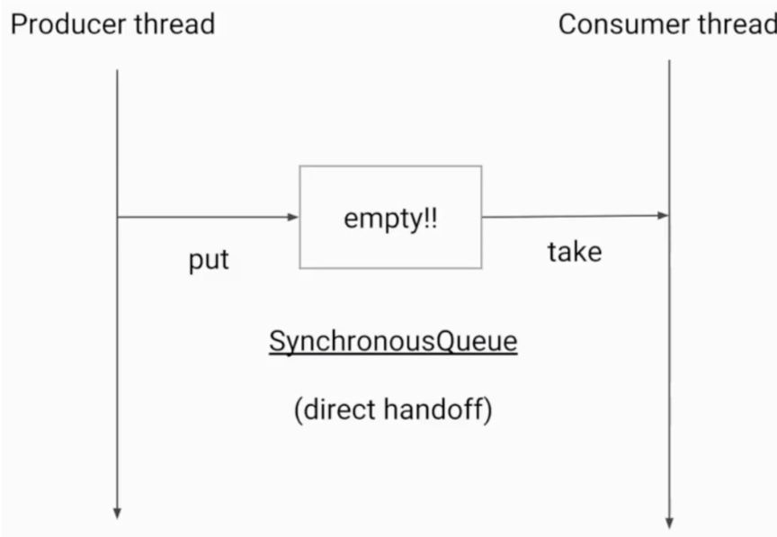
        - 注意点:SynchronousQueue没有peek()等函数,因为peek的作用是取出头结点,但是SynchronousQueue容量为0,所以peek对于SynchronousQueue没有意义,同样还有iterate相关方法
        - SynchronousQueue是线程池Excutors.newCachedThreadPool()使用的阻塞队列
    - DelayedQueue
        - 延迟队列,根据延迟时间排序
        - 元素需要实现Delayed接口,规定排序规则,无界的队列
5. 非阻塞队列(使用场景比阻塞队列少得多)
    - 并发包中的非阻塞队列只有ConcurrentLinkedQueue这一种,顾名思义,ConcurrentLinkedQueue是使用链表作为其数据结构的,使用CAS非阻塞算法来
    实现线程安全(不具备阻塞功能),适用于对性能要求比较高的并发场景,用的相对较少
6. 如何选择合适的队列
    - 考虑边界
    - 考虑空间
    - 考虑吞吐量,比如LinkedBlockingQueue有两把锁,粒度较ArrayBlockingQueue细
----
# 九.控制并发流程
## 什么是控制并发流程
1. 控制并发流程的工具类,作用就是帮助程序员更容易的让线程之间进行合作
2. 让线程之间相互配合,来满足业务逻辑
3. 比如让线程A等待线程B执行完毕以后再执行等合作策略
4. 
## CountDownLatch倒计时门闩
1. CountDownLatch类的作用
    - 例子:购物拼团;过山车==>人满发车
    - 流程:倒数结束之前,一直处于等待状态,直到倒计时结束了,此线程才继续过程
    - CountDownLatch(int count):仅有一个构造函数,参数count为需要倒数的值
    - await():调用await()方法的线程会被挂起,它会等待直到count的值为0才会继续执行
    - countDown():将count减1,直到count为0,等待的线程才会被唤醒
    - 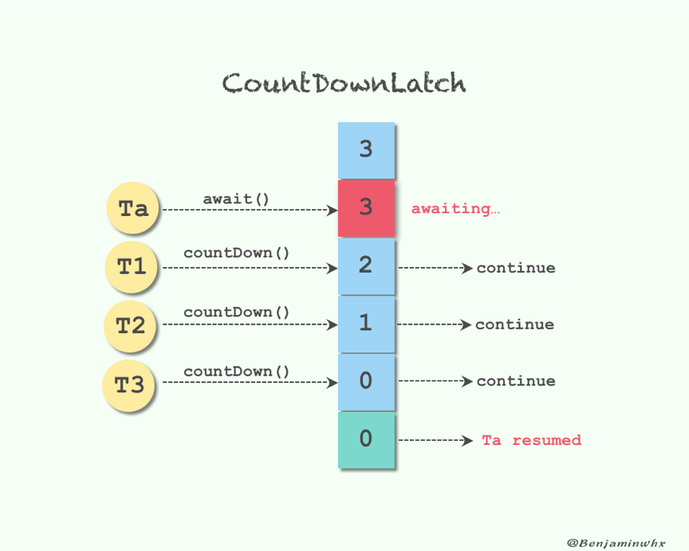
2. CountDownLatch两种经典场景
    - 用法1,一个线程等待多个线程都执行完毕,再继续自己的工作  
    [CountDownLatchDemo1.java](src/main/java/com/lyming/flowcontrol/countdownlatch/CountDownLatchDemo1.java)
    - 用法2,多个信号等待一个信号,同时开始执行  
    [CountDownLatchDemo2.java](src/main/java/com/lyming/flowcontrol/countdownlatch/CountDownLatchDemo2.java)
    - 结合用法1和用法2  
    [CountDownLatchDemo1And2.java](src/main/java/com/lyming/flowcontrol/countdownlatch/CountDownLatchDemo1And2.java)
    - 扩展用法:可以实现多等多
    - 注意CountDownLatch不能重用,如果需要重新计数,考虑用CyclicBarrier或者重新创建CountDownLatch对象
## Semaphore信号量
1. Semaphore可以用来限制或者管理数量有限的资源的使用情况
2. 信号量的作用是维护一个`许可证`的计数,线程可以`获取`许可证,那信号量剩余的许可证就减一,线程也可以`释放`一个许可证,那么信号量剩余的许可证就加一,
当信号量所拥有的许可证数量为0,那么下一个还想要获取许可证的线程就需要等待,直到另外的线程释放许可证
3. 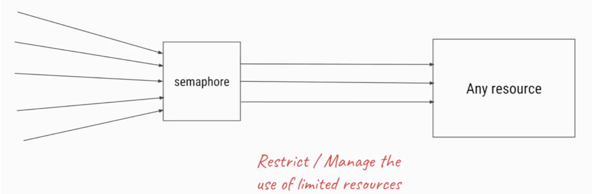
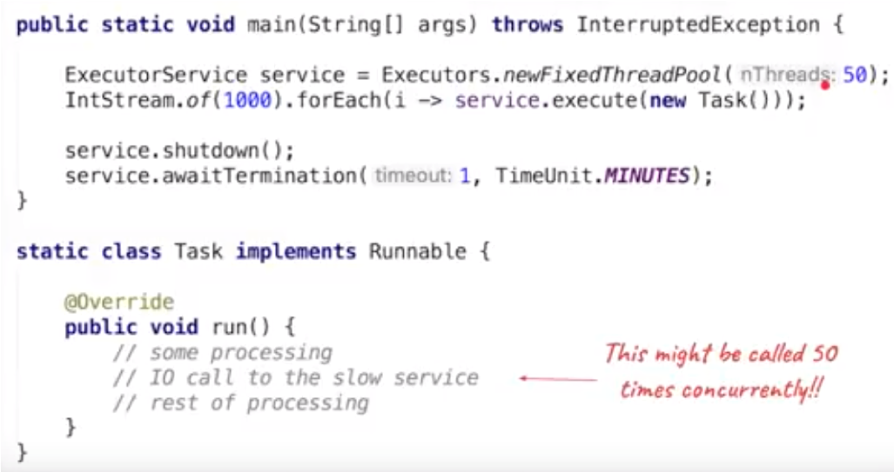
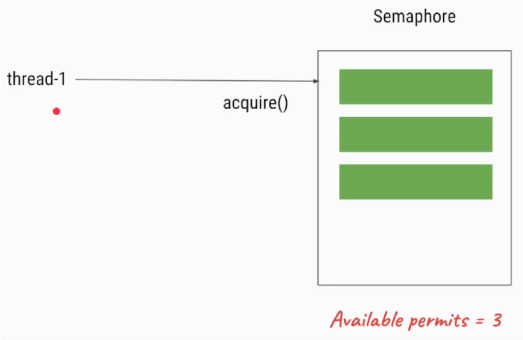
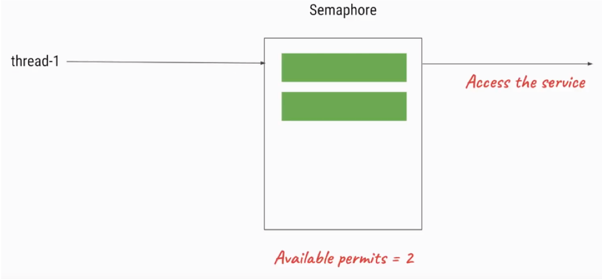

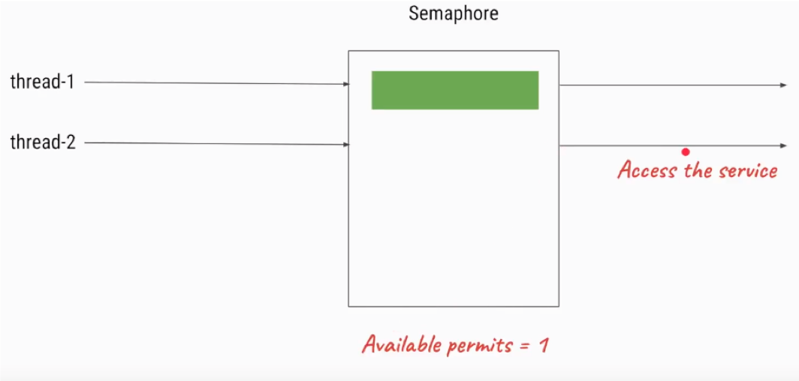
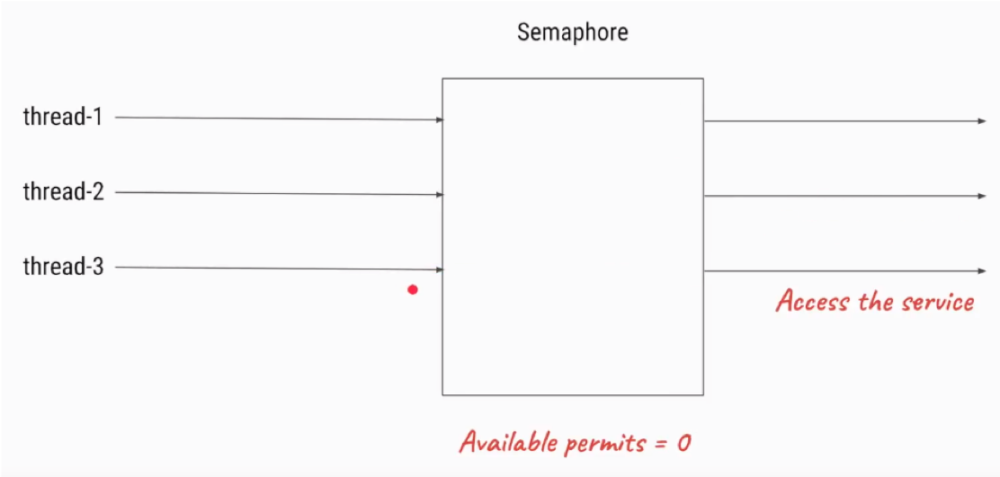
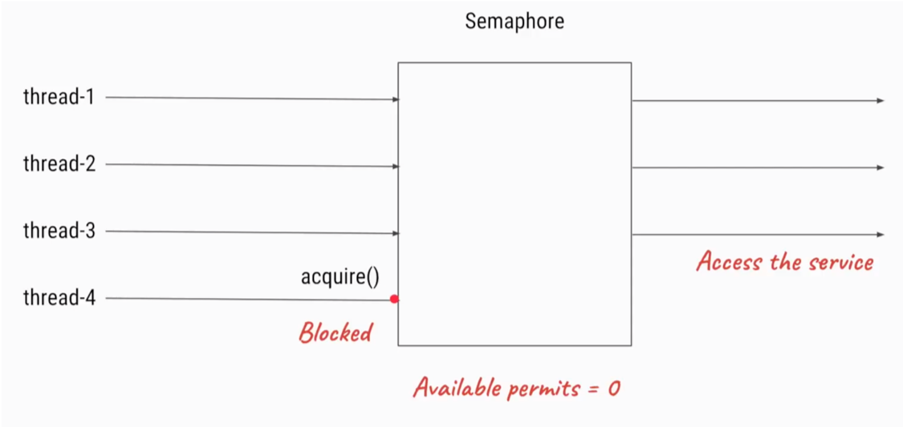

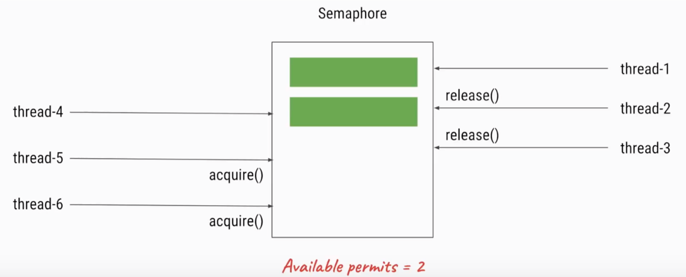
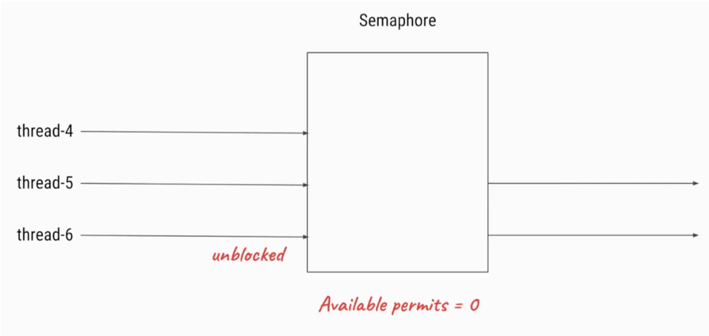
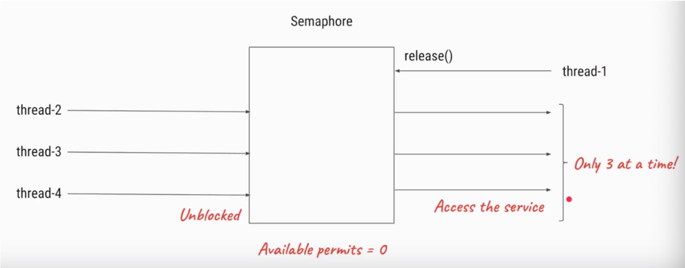
4. 信号量使用流程
    1. 初始化Semaphore并制定许可证的数量
    2. 在需要被现在的代码加`acquire()`或者`acquireUninterruptibly()`
    3. 任务结束后,调用`release()`释放许可证
5. 主要方法介绍
    - new Semaphore(int permits,boolean fair):这里可以设置使用公平策略,如果传入true,那么Semaphore会把之前等待的线程放到FIFO队列里,
    以便当有了许可证,可以分发给之前等待时间最长的线程
    - acquire():获取,能够响应中断
    - acquireUninterruptibly():获取,不能响应中断,如果有异常,需要自己处理
    - tryAcquire():和之前的TryLock很相似,看看有没有空闲的许可证,如果有就获取,没有也不阻塞,做别的事情,过一会儿再来查看许可证空闲情况
    - tryAcquire(timeout):和tryAcquire()多了一个超时时间,比如超过三面没有获取到许可证,就去做别的事情
    - release():归还许可证,如果不手动调用,程序是不会自动归还许可证的
    - 代码示例[SemaphoreDemo.java](src/main/java/com/lyming/flowcontrol/semaphore/SemaphoreDemo.java)
6. 注意点
    - 获取和释放的许可证数量必须一致,否则比如每次获取两个,释放一个甚至不释放,随着时间的推移,程序会卡死,因为许可证数量不够用了
    - 注意在初始化Semaphore的时候设置公平性,一般设置为公平,true比较好
    - 并不是必须由获取许可证的线程释放那个许可证,事实上,获取和释放许可证对线程并无要求,也就是说A获取了,由B释放,只要逻辑合理即可
## Condition接口
## CyclicBarrier循环栅栏