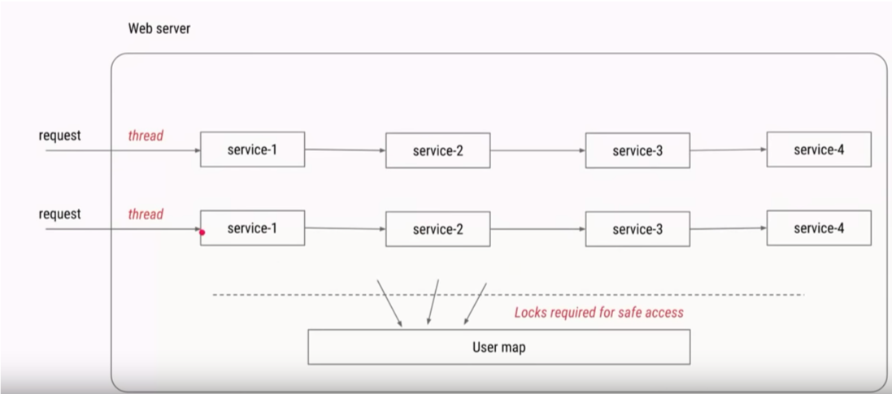
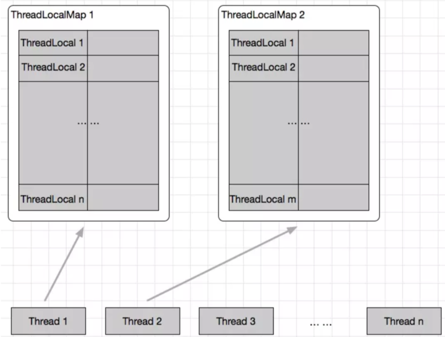

# 一.分类概览
## 并发安全（线程安全）
### 底层角度
1. 互斥同步
- 各种互斥同步锁
    - synchronized
    - ReentryLock
    - ReadWriteLock
    - ...
- 同步工具类
    - Collections.synchronizedList(New ArrayList<E>())
    - Vector  
2. 非互斥同步
    - 6种原子类
        - 基本原子类
            
3. 结合互斥和非互斥同步
    - 并发容器
        - ConcurrentHashMao
        - CopyOnWriteArraylist
        - 并发队列
            - 阻塞队列(和线程池关系紧密)
                1. ArrayBlockingQueue
                2. LinkedBlockingQueue
                3. PriorityBlockingQueue
                4. SynchronousQueue
                5. DelayedQueue
                6. TransferQueue
                7. ...
            - 非阻塞队列
                - ConcurrentLinkedQueue
        - ConcurrentSkipListMap和ConcurrentSkipListSet
4. 无同步方案,不可变
    - final关键字
    - 线程封闭
        - ThreadLocal
        - 栈封闭
### 使用者角度
1. 避免共享变量
    - 线程封闭
        -  TreadLocal
        -  栈封闭
2. 共享变量,但是加以限制
    - 互斥同步
        - 使用各种互斥同步锁
    - final关键字        
3. 使用成熟的工具类
    - 线程安全的并发容器
        - ConcurrentHashMap
        - CopyOnWriteArrayList
        - 并发队列
        - ConcurrentSkipListMap和ConcurrentSkipListSet
        - 使用同步工具类
    - atomic包,原子类    
## 线程管理
   - 线程池相关类
     - Executor
     - Executors
     - ExecutorService
     - 常见线程池
       - FixedTheadPool
       - CachedThreadPool
       - ScheduledThreadPool
       - SingleTheadPool
       - ForkJoinPool
       - ...
    
   - 能获取子线程的运行结果
     - Callable
     - Future
     - Future Task
     - ...
## 线程协作
  - CountDownLatch
  - CycliBarrier
  - Semaphore
  - Condition
  - Exchanger
  - Phaser
  - AQS
  - ...
---

# 二.线程池
## 为什么要用线程池
### 问题
1. 反复创建线程开销大
2. 过多的线程会占用太多内存
### 好处
1. 加快相应速度
2. 合理利用CPU和内存资源
3. 统一管理
### 使用场合
1. 服务器接收到大量请求,tomcat和netty内部都使用了线程池
2. 开发中,如果需要创建5个以上的线程,用线程池效率较高
## 创建和停止线程池
1.  构造函数的参数
    1. corePoolSize(int):核心线程数,通常会一直存活
    2. maxPoolSize(int):最大线程数
    3. keepAliveTime(long): 线程保持存活的最长时间(默认针对多余核心数量的线程)
    4. workQueue(Blocking Queue):任务存储队列
    5. thredFactory(TreadFactory):线程工厂
    6. Handler(RejectedExecutionHandler):拒绝处理器
2.  线程池应该手动创建还是自动创建
3.  线程池里面的线程数量设置为多少才合适 
4.  如何停止线程池
##线程里的线程数量设置成多少
1. CPU密集型(加密,计算hash等):最佳线程数为CPU核心数的1~2倍
2. 耗时IO(读写数据库,文件,网络读写等):参考Brain Goetz推荐的计算方法`线程数=CPU核心数*(1+平均等待时间/平均工作时间)
3. 实际以压测为准
##比较常见四种线程池的构造函数参数
 |Parameter| FixedThreadPool | CachedThreadPool |ScheduledThreadPool | SingleThreadPool|
 |-|-|-|-|-|
 |corePoolSize|constructor-arg|0|constructor-arg|1|
 |maxPoolSize|same as corePoolSize|Integer.MAX_VALUE|Integer.MAX_VALUE|1|
 |keepAliveTime|0 seconds|60 seconds|0 seconds|0 seconds|
 ## 阻塞队列分析
 1. FixedThreadPool和SingleThreadExecutor的Queue是LinkedBlockingQueue(无限大)
 2. CachedThreadPool使用的Queue是SynchronousQueue(不存储)
 3. ScheduledThreadPool用的DelayedWorkQueue
 4. JDK8加入workStealingPool线程池

 ## 停止线程
 1. shutdown():并不会马上停止,会把队列中等待的任务和正在执行的任务全部执行完,才会停止线程池,但是不会再接收新的任务
 2. isShutdown():判断线程池是否进入停止状态
 3. isTerminated():判断线程是否完全停止
 4. awaitTermination():测试线程池在未来几秒会不会停止,返回一个boolean值
 5. shutdownNow():立刻停止线程池,返回队列和正在执行的任务的列表

## 任务太多怎么拒绝
1. 拒绝时机
   1. 当Executor关闭时,新任务会被拒绝
   2. 当线程池所有线程都在执行任务,队列里面任务也满了,也会拒绝
2. 拒绝策略
   1. AbortPolicy:直接拒绝,抛出异常
   2. DiscardPolicy:默默丢弃,不会通知
   3. DiscardOldestPolicy:丢弃最老的
   4. CallerRunsPolicy:让提交任务的线程(一般是主线程)去执行任务,负反馈机制,给线程池缓冲时间
## 钩子算法
- 在任务执行前后加日志,统计之类的
- 代码演示:PauseableThreadPool.java

## 线程池组成部分
1. 线程池管理器
2. 工作线程
3. 任务队列(blocking queue)
4. 任务接口(Task)

## Executor家族

## 线程池状态
1. Running:接收新任务并处理排队任务
2. ShutDown:不接受新任务,但是处理排队任务
3. Stop:不接受新任务,也不处理排队任务,并且中断正在进行的任务
4. Terminated:terminate()执行完成
5. Tidying:所有任务都已经终止,workerCount为0,然后会运行terminate钩子方法

## 使用线程池的注意点
1. 避免任务堆积
2. 避免线程数过度增加
3. 排查线程泄露
----
# 三.ThreadLocal
## 两大使用场景
1. 每个线程需要一个独享的对象(通常是工具类,典型的包括SimpleDateFormat和Random,因为他们线程不安全)
    - 每个Thread内有自己的实例副本,不共享
    - 代码演示ThreadLocalNormalUsage00.java~ThreadLocalNormalUsage05.java
2. 每个线程内需要保存全局的变量(比如拦截器中获取用户信息),可以让不同方法直接使用,避免传递参数的麻烦
    - 遇到的问题:
        - 每一次业务传递都要传递用户信息
    - 解决方案1:
        - 图中才用静态的UserMap对象存储用户信息,可以如果涉及到多线程,是无法保证线程安全的
    - 解决方案1遇到的问题:
        - 这种情况下可以用Synchronize或者ConcurrentHashMap来解决,但是都会对性能造成影响
    - 最终解决方案:使用ThreadLocal
        - 用ThreadLocal保存一些业务内容(用户权限信息,用户名,userId等)
        - 这些信息在同一个线程内相同,在不同的线程内使用的业务内容是不相同的
        - 在线程生命周期里,都通过这个静态ThreadLocal实例的get()获取之前set过的那个对象,避免了对象作为传参的麻烦
        - 强调的是同一个请求(同一个线程里)不同方法的共享
        - 不需要重写initialValue()方法,但必须手动调用set()方法
3. 代码见[ThreadLocalNormalUsage06.java](src/main/java/com/lyming/threadlocal/ThreadLocalNormalUsage06.java)
4. 总结
    - ThreadLocal的两大作用
        1. 让某个需要用到的对象线程隔离(每个线程都有自己独立的对象)
        2. 在任何方法中都可以轻松获取到该对象
    - 根据对象的生成时机不同,选择initialValue()或者set()保存对象
        1. 在ThreadLocal第一次get的时候把对象给初始化出来,对象初始化受我们自己控制用`initialValue()`
        2. ThreadLocal保存的对象不由我们控制,比如由拦截器控制就用`set()`
    - ThreadLocal带来的好处
        1. 达到线程安全
        2. 不需要加锁,提高执行效率
        3. 更加高效利用内存,节省开销
        4. 避免传参的繁琐,降低耦合
## 原理
1. 区分Thread,ThreadLocal,ThreadMap
  
  在每个Thread中都持有一个ThreadMap对象
2. 常用方法
    - T initialValue():
        - 该方法会返回当前线程对应的初始值,这是一个延迟加载的方法,只有调用get()的时候才会触发;
        - 但是如果手动set,就不会调用initialValue();
        - 通常情况下,每个线程最多只调用一次该方法,除非调用了remove(),再次调用get()还是会调用initialValue()
        - 如果不重写initialValue(),默认会返回null,一般都使用匿名内部类来重写initialValue()方法
    - void set(T t):为该线程设置一个新值
    - T get():得到这个线程对应的Value,如果首次调用,则会调用initialValue()方法来得到该Value
    - void remove():删除对应这个线程的值
    -  **需要注意的是**保存的东西实际是保存在线程当中,而不是ThreadLocal中,通过源码可以知道,ThreadLocalMap是Thread的一个成员变量,而TreadLocal的Set方法,实际调用的是ThreadLocalMap的set(ThreadLocal local,T value)方法
    - ThreadLocalMap和HashMap很相似,有一点不同就是解决hash冲突的算法,常规的hashmap会采用拉链法,长度>8采用红黑树,而ThreadLocalMap则是采用线性探测法,将冲突的元素赋值给下一个空的内存中